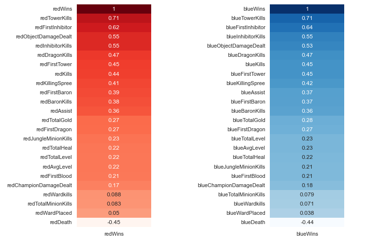

# League-of-Legends-Ranked-Match-Prediction 
Classification High elo (Challenger) Ranked Games Results using Random Forest and Logistic Regression
## Intro
League of Legends is a MOBA (multiplayer online battle arena) where 2 teams (blue and red) face off. There are 3 lanes, a jungle, and 5 roles. The goal is to take down the enemy Nexus to win the game. This dataset include blue team and red team information from Challenger ranked games, also contains key information that can affect the win or loss in the game. Each game is unique. The gameId can help you to fetch more attributes from the Riot API. The heart of the data is the result of the match between the blue and red teams.

## Dataset Exploration

## Data Cleaning

## EDA
### Average game length

Description here

### Both team win percentage

Description here

### Correlation between features and target

### Getting First Tower = Win!

### Total dragons killed vs Target

## Data Preprocessing

### Handling outlier

### Feature Selection

### Split dataset and data scalling
I split dataset to 70% train and 30% test and scale the dataset with MinMaxScaler()

## Modelling and Evaluation
I try to use Logistic Regression and Random Forest. 
*Most suitable model for the dataset:* **Random Forest**

## Sources of the datasets 
1. [League of Legends Dataset](https://www.kaggle.com/gyejr95/league-of-legends-challenger-ranked-games2020)

